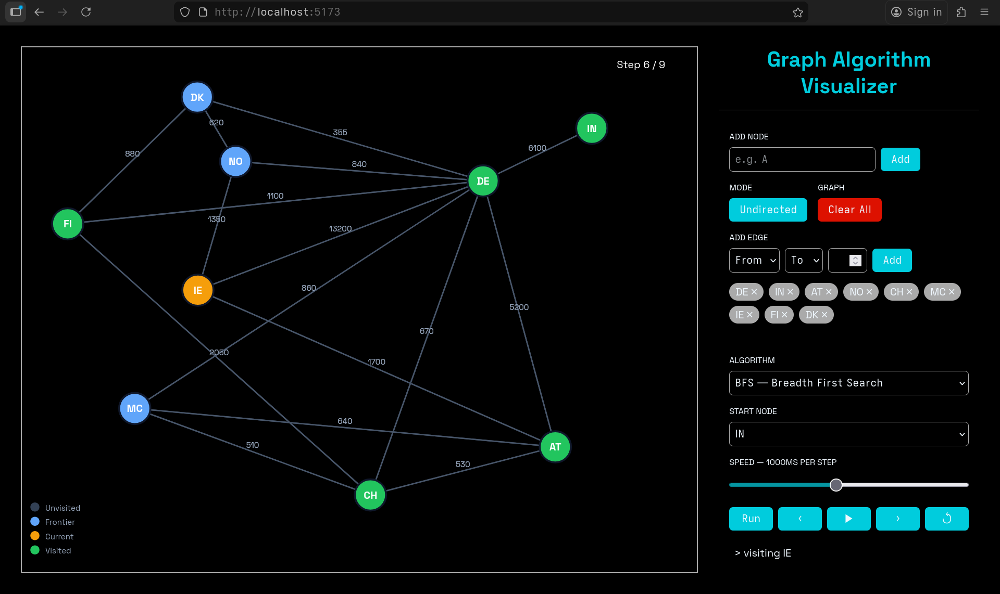

# Graph Algorithm Visualiser

> Step-by-step visualisation of BFS, DFS, and Dijkstra — built with Go + SvelteKit



---

## What it does

Build any graph interactively, pick an algorithm, and watch it execute one step at a time. Every node state — unvisited, queued, active, settled — is colour-coded in real time.

- **BFS** — explores level by level, guarantees shortest path on unweighted graphs
- **DFS** — goes deep before backtracking, uses the call stack recursively
- **Dijkstra** — greedy shortest path on weighted graphs via distance relaxation

---

## Features

- Add and remove nodes and edges interactively
- Weighted edges with live labels on the canvas
- Toggle between directed and undirected graphs
- Draggable nodes — arrange your graph however you like
- Step through execution manually (prev / next) or let it play automatically
- Step counter overlaid directly on the canvas

---

## Stack

| Layer | Technology |
|---|---|
| Backend | Go, Chi router |
| Frontend | SvelteKit, TypeScript |
| Visualisation | D3.js |
| Communication | REST API over HTTP |
| Containerisation | Docker (PostgreSQL) |

---

## Running locally

**Prerequisites:** Go 1.22+, Node.js 18+

```bash
# clone
git clone https://github.com/z66x/graph-visualizer
cd graph-visualizer

# backend
cd backend
go run main.go
# → running on :8080

# frontend (new terminal)
cd frontend
npm install
npm run dev
# → running on localhost:5173
```

---

## API

| Method | Endpoint | Description |
|---|---|---|
| POST | `/api/bfs` | Run BFS from a start node |
| POST | `/api/dfs` | Run DFS from a start node |
| POST | `/api/dijkstra` | Run Dijkstra from a start node |

**Request body:**
```json
{
  "graph": {
    "nodes": ["A", "B", "C"],
    "edges": {
      "A": [{ "to": "B", "weight": 4 }, { "to": "C", "weight": 2 }],
      "B": [{ "to": "C", "weight": 1 }],
      "C": []
    },
    "directed": true
  },
  "start": "A"
}
```

**Response:** Array of execution steps, each containing current node, visited set, frontier, and a human-readable message.

---

## Implementation notes

- Graph is represented as an **adjacency list** — O(V + E) space vs O(V²) for a matrix
- Dijkstra uses **linear scan** for minimum distance — O(V²). A min-heap implementation would give O(E log V) — a known improvement left as future work
- Algorithm execution is **stateless** on the server — each request recomputes from scratch, no session state
- Frontend animation is driven by stepping through a pre-computed steps array — no polling